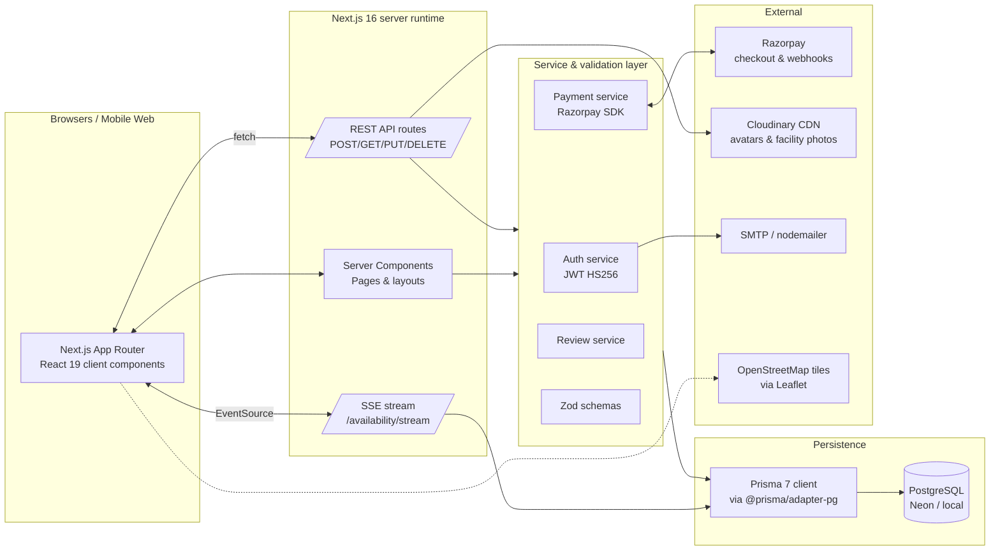

# QuickCourt

A full-stack sports-venue booking platform — **player booking → owner management → admin moderation** — built on Next.js 16, Prisma 7, PostgreSQL, with real-time slot updates, geospatial search, content-based recommendations, and a match-making feed.


---

## What's inside

| Surface              | Capability                                                                                            |
| -------------------- | ----------------------------------------------------------------------------------------------------- |
| **Player**           | Discover venues, filter, map view, book slots, pay via Razorpay, cancel + auto-refund, review, vote helpful, join open matches |
| **Owner**            | List facilities, manage courts, drag-drop photo upload, block slots for maintenance, see live earnings + per-court analytics + 24×7 heatmap, respond to reviews |
| **Admin**            | Approve facilities, moderate reviews, manage users/refunds, platform revenue analytics                |
| **Hero features**    | Live-updating slot availability (SSE), Leaflet map + radius search, content-based "Recommended for you" rail, match-making feed with capacity & skill level |

---

## Architecture



### Request flow examples

- **Book a court** → client opens `EventSource` for live updates → POST `/api/bookings` → POST `/api/bookings/[id]/pay` (Razorpay order) → Razorpay checkout → POST `/api/payments/verify` (HMAC SHA-256) → confirmation.
- **Open a match** → POST `/api/matches` with bookingId → booking flagged `isPublic` → appears on `/matches` for other players → POST `/api/matches/[id]/join` → upserts `BookingParticipant`.
- **Live slot updates** → server polls `bookings` + `time_slots` every 3 s, hashes the occupancy set, streams `event: update` only when it changes; client re-fetches REST availability on each update.

---

## Tech stack

- **Framework:** Next.js 16 (App Router, Turbopack), React 19, Tailwind v4
- **Backend:** Next.js route handlers (Node runtime), Prisma 7 + `@prisma/adapter-pg`, PostgreSQL
- **Auth:** JWT (HS256, `jsonwebtoken`), bcrypt password hashing
- **Payments:** Razorpay SDK, server-side signature verification
- **Storage:** Cloudinary (CDN) with local-disk fallback for dev
- **Map:** `react-leaflet` + OpenStreetMap tiles (no API key)
- **Email:** nodemailer (SMTP)
- **Observability:** Pino structured logger, Sentry scaffold (env-gated)
- **Testing:** Vitest unit tests + standalone Node E2E API suite
- **Design system:** Material Design 3 tokens, Fraunces (display) + JetBrains Mono + Inter (loaded at runtime, no build-time fetch)

---

## Getting started

### Prerequisites

- Node.js **≥ 20**
- PostgreSQL (Neon, Supabase, or local)
- Razorpay test keys (for payment flows)

### Local setup

```bash
git clone <repo>
cd quickcourt
npm install

cp .env.example .env       # then edit values — see "Environment variables" below
npx prisma generate
npx prisma db push          # syncs schema to DB

npm run dev                 # http://localhost:3000
```

### Docker (everything in one command)

```bash
docker compose up --build
# app at http://localhost:3000, Postgres on :5432
```

The compose file boots Postgres, waits for it, runs `prisma db push`, then starts the production-built Next.js server. Set the same env vars in `.env` and Docker Compose will read them.

---

## Environment variables

| Variable                                       | Required | Purpose                                                                |
| ---------------------------------------------- | -------- | ---------------------------------------------------------------------- |
| `DATABASE_URL`                                 | **yes**  | Postgres connection string                                             |
| `JWT_SECRET`                                   | **yes**  | HS256 signing secret                                                   |
| `JWT_EXPIRES_IN`                               | no       | Token TTL (default `7d`)                                               |
| `NEXT_PUBLIC_APP_URL`                          | **yes**  | Used in metadata, OG, payment callbacks                                |
| `RAZORPAY_KEY_ID` / `RAZORPAY_KEY_SECRET`      | **yes**  | Razorpay server credentials                                            |
| `RAZORPAY_WEBHOOK_SECRET`                      | **yes**  | Verifies webhook signatures                                            |
| `SMTP_HOST` / `SMTP_PORT` / `SMTP_USER` / `SMTP_PASS` / `EMAIL_FROM` | **yes**  | OTP + cancellation + receipt emails |
| `CLOUDINARY_CLOUD_NAME` / `_API_KEY` / `_API_SECRET` | optional | When set, images upload to Cloudinary CDN; otherwise disk fallback   |
| `SENTRY_DSN`                                   | optional | Enables error tracking (install `@sentry/nextjs` separately)           |
| `LOG_LEVEL`                                    | optional | `trace`/`debug`/`info`/`warn`/`error` (default `info` in prod)         |

---

## Scripts

```bash
npm run dev          # start Turbopack dev server
npm run build        # production build (verifies all routes compile)
npm start            # serve the built app
npm run lint         # ESLint
npm test             # Vitest unit tests
npm run test:watch   # Vitest in watch mode
npm run test:coverage
npm run test:e2e     # full API E2E suite (needs dev server up + DB)
```

---

## Testing

### Unit (Vitest) — 26 tests across 3 files

```
src/__tests__/payment.test.js        # processing fees, refund tiers, order-id format
src/__tests__/slot-overlap.test.js   # half-open-interval booking-conflict math
src/__tests__/validation.test.js     # facility/review/deactivation Zod schemas
```

Run with `npm test`. Coverage report: `npm run test:coverage` → `coverage/index.html`.

### E2E API (Node) — 55 checks

[scripts/api-e2e-test.mjs](scripts/api-e2e-test.mjs) mints a JWT per role from real DB users and exercises every major endpoint:

- All public reads (home, search, cities, filters, nearby, sports, amenities, matches)
- Player flows (profile, dashboard, recommendations, helpful vote, match validation)
- Owner full CRUD lifecycle: create facility → view own PENDING → update → create court → update court → block slots → unblock → delete court → delete facility
- Admin reads + RBAC denial
- Destructive deactivation on a throwaway user (wrong password → 401, correct → 200, DB flag flipped, user cleaned up)

Run with `npm run test:e2e` while `npm run dev` is up.

### CI

[.github/workflows/ci.yml](.github/workflows/ci.yml) runs lint, unit tests, and a production build on every push and pull request to `main`.

---

## Project layout

```
src/
├── app/                     # Next.js App Router
│   ├── api/                 # Route handlers (REST + SSE)
│   ├── (player routes)      # /, /venues, /matches, /booking/...
│   ├── auth/                # login, register, verify-otp
│   ├── dashboard/           # player dashboard
│   ├── owner/               # owner dashboard, facilities, earnings, analytics
│   └── admin/               # admin console
├── components/
│   ├── booking/             # TimeSlotPicker (SSE-backed), DatePicker, PaymentForm, …
│   ├── dashboard/           # Player bookings/reviews/profile, BookingCard, RecommendedForYou
│   ├── owner/               # FacilityDetail, BlockSlotsManager, FacilityPhotosManager, …
│   ├── admin/               # Approvals, Users, Revenue, Moderation
│   ├── layout/              # Navbar, Footer
│   ├── venues/              # listing, filters, map, reviews
│   └── ui/                  # Icon (Material Symbols), Button, ToastProvider, …
├── contexts/                # AuthContext, ApiContext, ThemeContext
├── services/                # auth, payment, review service classes
├── validations/             # Zod schemas (input contracts)
├── lib/                     # prisma client, logger, sentry, cloudinary, auth helpers
├── prisma/schema/           # schema.prisma
└── __tests__/               # Vitest unit tests

scripts/
├── api-e2e-test.mjs         # end-to-end API smoke test
└── debug-admin-400.mjs      # one-off debugging
```

---

## Design system

Material Design 3 — colors, typography, surfaces, motion.

- **Palette:** primary green `#006B2C` (turf), mint primary-container `#B4F0C1`, warm orange secondary-container `#FD761A`, blue tertiary `#0058BE`, full dark-mode variant via `.dark` token swap.
- **Type:** Fraunces (display serif), JetBrains Mono (numbers/labels/eyebrows), Inter (body). Loaded at runtime via Google Fonts `<link>` so build never depends on the network.
- **Components:** `.card`, `.btn-primary/.btn-cta/.btn-outline/.btn-ghost`, `.pill` (4 colour variants), `.eyebrow`, `.slot` (booked/blocked/past states), `.tab`, `.avatar`, `.live-dot`, `.stripe-divider`, `.court-tile`. All wrapped in `@layer components` so Tailwind utilities reliably override.

---

## Deployment

### Vercel

1. Import the repo.
2. Set the env vars from the table above.
3. Build command: `next build` · output: `.next`. Vercel handles the rest.

### Docker / VPS

```bash
docker compose up -d --build
```

For a stand-alone container with an external DB, build the image with `docker build -t quickcourt .` and run with `-e DATABASE_URL=…` etc.

### Database migrations

The project currently uses `prisma db push` (schema-first) because the production DB drifted from the migration history early on. To rebuild a clean migration baseline:

```bash
npx prisma migrate diff --from-empty --to-schema-datamodel src/prisma/schema/schema.prisma --script > prisma/migrations/init.sql
```

Then `prisma migrate deploy` in CI.

---

## Roadmap

See [TODO.md](TODO.md) for the live punch list. The remaining nice-to-haves:

- Playwright browser E2E (Razorpay test-mode payment, SSE pulse, map interaction)
- Migrate `` → `next/image` (35 pre-existing lint warnings)
- PostHog / Plausible product analytics
- Consolidate Prisma migration history

---

## License

Private project. All rights reserved.
